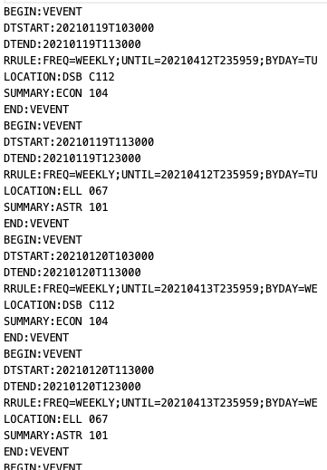
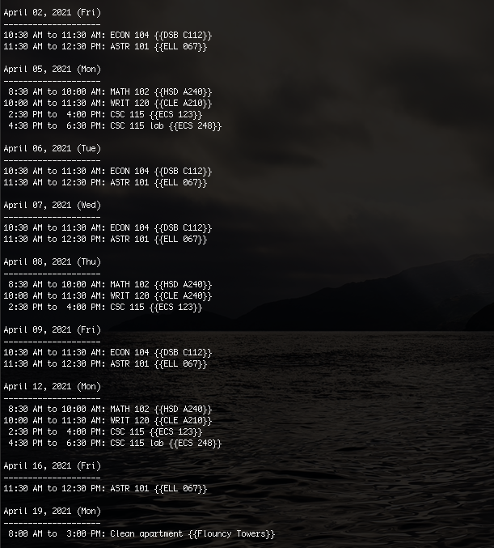
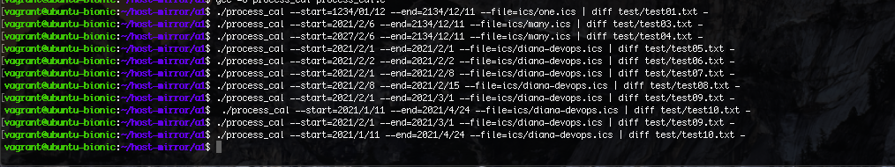
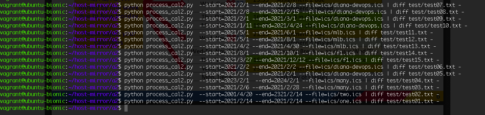
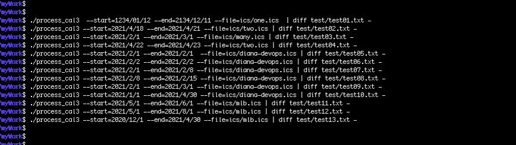
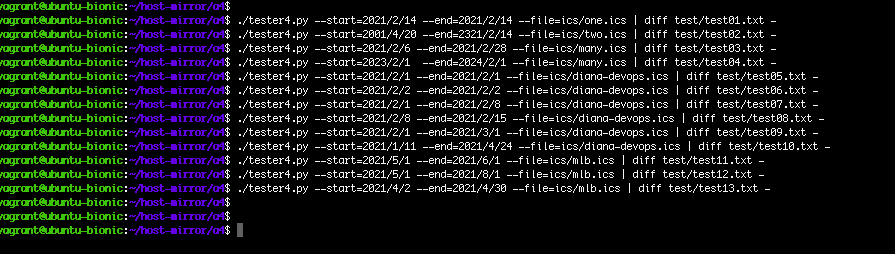

# Ical Extension:

This repo consists of my multiple different versions of the same program

# Demo
- input .ics file:
- 
- output to console:
- 

# a1 and a3 are written in C:
-  a1: arrays, string manipulation in C

-  a3: dynamic memory allocation, linked lists, dynamic programming, 

# a2 and a4 are written in Python:
- a2: dictionaries, lists, 

- a4: multiple classes, Regexs, more robust than others

